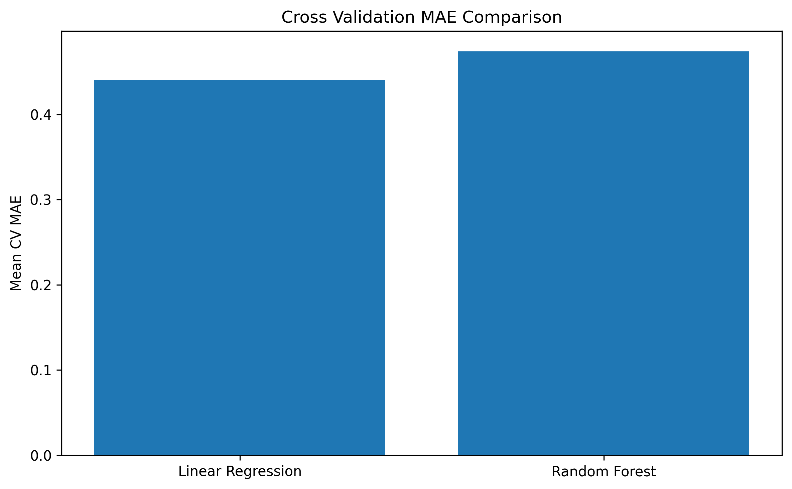

# Day 12 - Cross Validation Results

## TimeSeriesSplit

n_splits = 3

## Linear Regression CV Scores

[0.46248617 0.45089361 0.40676235]

Average CV MAE: 0.440

## Random Forest CV Scores

[0.51603699 0.47229452 0.43391096]

Average CV MAE: 0.474

## CV Results Summary

| Model             |   Mean CV MAE |   CV Std |   Test MAE |
|:------------------|--------------:|---------:|-----------:|
| Linear Regression |         0.44  |    0.024 |      0.419 |
| Random Forest     |         0.474 |    0.034 |      0.442 |

## Overfitting Analysis

Linear Regression Train MAE: 0.415

Linear Regression Test MAE: 0.419

Random Forest Train MAE: 0.167

Random Forest Test MAE: 0.442

### Interpretation

Potential overfitting detected. Train MAE is much lower than Test MAE.

## CV MAE Comparison Chart

