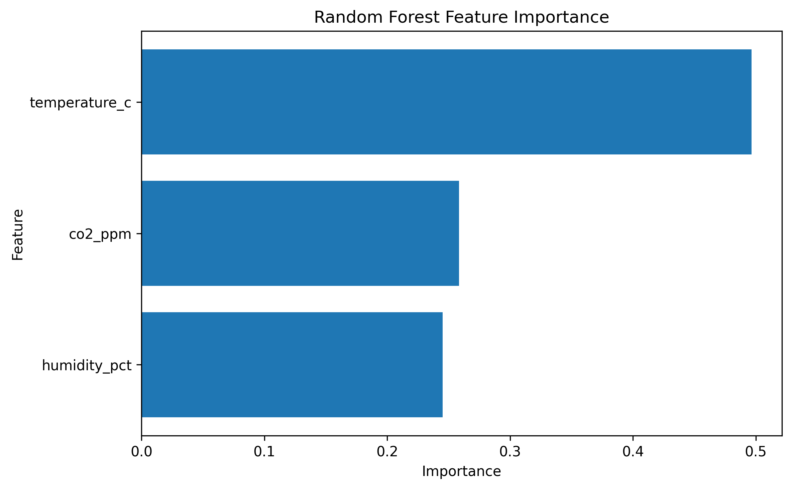

# Day 11 - Random Forest Regressor

## Dataset

- Features: temperature_c, humidity_pct, co2_ppm
- Target: yield_kg

## Model Comparison

| Model             |   MAE |   RMSE |    R2 |
|:------------------|------:|-------:|------:|
| Linear Regression | 0.419 |  0.535 | 0.427 |
| Random Forest     | 0.442 |  0.576 | 0.337 |

## Feature Importance

| Feature       |   Importance |
|:--------------|-------------:|
| humidity_pct  |     0.245104 |
| co2_ppm       |     0.258335 |
| temperature_c |     0.496562 |

## Feature Importance Plot

## Model Artifact

Saved model path:

`models/random_forest.joblib`

## Interpretation

Random Forest showed little or no improvement over Linear Regression. In this case, Linear Regression may be preferred because it is simpler and more interpretable.
